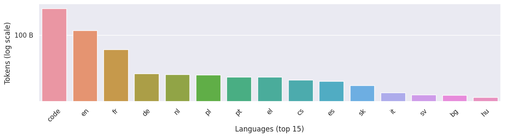
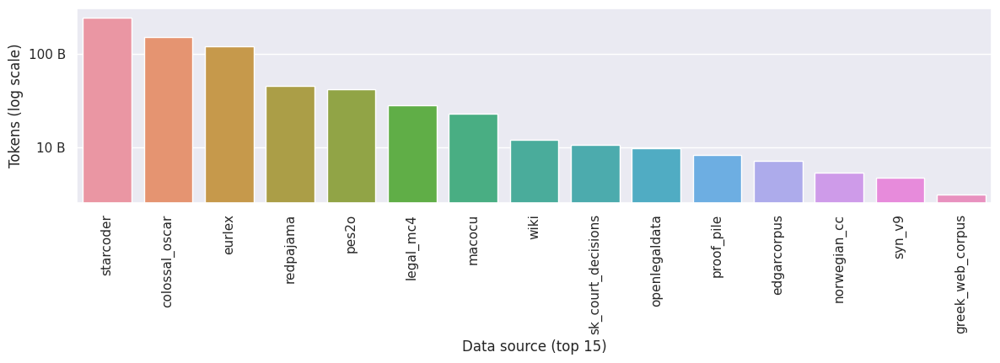

  # Datasets

The framework provides 2241 datasets from 62 sources in 164 languages. The languages are as follows: Afrikaans, Amharic, Aragonese, Arabic, Arz, Assamese, Ast, Avaric, Azerbaijani, Azb, Bashkir, Belarusian, Bulgarian, Bihari, Bengali, Tibetan, Bpy, Breton, Bosnian, Bxr, Catalan, Chechen, Ceb, Ckb, Code, Czech, Chuvash, Welsh, Danish, German, Dsb, Dhivehi, Greek, English, Esperanto, Spanish, Estonian, Basque, Persian, Finnish, French, Western Frisian, Irish, Gaelic, Galician, Guaraní, Gom, Gsw, Gujarati, Hausa, Hebrew, Hindi, Croatian, Hsb, Haitian, Hungarian, Armenian, Interlingua, Indonesian, Interlingue, Igbo, Ilo, Ido, Icelandic, Italian, Japanese, Jbo, Javanese, Georgian, Kazakh, Khmer, Kannada, Korean, Krc, Kurdish, Komi, Cornish, Kirghiz, Latin, Luxembourgish, Lez, Limburgish, Lmo, Lao, Lithuanian, Latvian, Mai, Malagasy, Mhr, Min, Macedonian, Malayalam, Mongolian, Marathi, Mrj, Malay, Maltese, Multi, Mwl, Burmese, Mzn, Nah, Nds, Nepali, New, Dutch, Norwegian Nynorsk, Norwegian, Chichewa, Occitan, Oromo, Oriya, Ossetian, Panjabi, Polish, Pms, Pnb, Pashto, Portuguese, Quechua, Romanian, Russian, Kinyarwanda, Sanskrit, Sah, Sindhi, Serbo-Croatian, Sinhalese, Slovak, Slovene, Shona, Somali, Albanian, Serbian, Southern Sotho, Sundanese, Swedish, Swahili, Tamil, Telugu, Tajik, Thai, Tigrinya, Turkmen, Tagalog, Turkish, Tatar, Uighur, Ukrainian, Urdu, Uzbek, Vietnamese, Volapük, Walloon, War, Wuu, X-Eml, Xal, Xhosa, Xmf, Yiddish, Yoruba, Chinese, Zu

## Languages

| language   | reported_tokens   |
|:-----------|:------------------|
| af         | N/A               |
| am         | N/A               |
| an         | N/A               |
| ar         | N/A               |
| arz        | N/A               |
| as         | N/A               |
| ast        | N/A               |
| av         | N/A               |
| az         | N/A               |
| azb        | N/A               |
| ba         | N/A               |
| be         | N/A               |
| bg         | 13 B              |
| bh         | N/A               |
| bn         | N/A               |
| bo         | N/A               |
| bpy        | N/A               |
| br         | N/A               |
| bs         | N/A               |
| bxr        | N/A               |
| ca         | 4 B               |
| ce         | N/A               |
| ceb        | N/A               |
| ckb        | N/A               |
| code       | 250 B             |
| cs         | 21 B              |
| cv         | N/A               |
| cy         | N/A               |
| da         | 11 B              |
| de         | 26 B              |
| dsb        | N/A               |
| dv         | N/A               |
| el         | 24 B              |
| en         | 117 B             |
| eo         | N/A               |
| es         | 20 B              |
| et         | 5 B               |
| eu         | 982 M             |
| fa         | N/A               |
| fi         | 9 B               |
| fr         | 60 B              |
| fy         | N/A               |
| ga         | 669 M             |
| gd         | N/A               |
| gl         | 36 M              |
| gn         | N/A               |
| gom        | N/A               |
| gsw        | N/A               |
| gu         | N/A               |
| ha         | N/A               |
| he         | N/A               |
| hi         | N/A               |
| hr         | 8 B               |
| hsb        | N/A               |
| ht         | N/A               |
| hu         | 12 B              |
| hy         | N/A               |
| ia         | N/A               |
| id         | N/A               |
| ie         | N/A               |
| ig         | N/A               |
| ilo        | N/A               |
| io         | N/A               |
| is         | N/A               |
| it         | 14 B              |
| ja         | N/A               |
| jbo        | N/A               |
| jv         | N/A               |
| ka         | N/A               |
| kk         | N/A               |
| km         | N/A               |
| kn         | N/A               |
| ko         | N/A               |
| krc        | N/A               |
| ku         | N/A               |
| kv         | N/A               |
| kw         | N/A               |
| ky         | N/A               |
| la         | N/A               |
| lb         | N/A               |
| lez        | N/A               |
| li         | N/A               |
| lmo        | N/A               |
| lo         | N/A               |
| lt         | 5 B               |
| lv         | 4 B               |
| mai        | N/A               |
| mg         | N/A               |
| mhr        | N/A               |
| min        | N/A               |
| mk         | N/A               |
| ml         | N/A               |
| mn         | N/A               |
| mr         | N/A               |
| mrj        | N/A               |
| ms         | N/A               |
| mt         | 4 B               |
| multi      | N/A               |
| mwl        | N/A               |
| my         | N/A               |
| mzn        | N/A               |
| nah        | N/A               |
| nds        | N/A               |
| ne         | N/A               |
| new        | N/A               |
| nl         | 26 B              |
| nn         | 301 M             |
| no         | 5 B               |
| ny         | N/A               |
| oc         | N/A               |
| om         | N/A               |
| or         | N/A               |
| os         | N/A               |
| pa         | N/A               |
| pl         | 25 B              |
| pms        | N/A               |
| pnb        | N/A               |
| ps         | N/A               |
| pt         | 24 B              |
| qu         | N/A               |
| ro         | 9 B               |
| ru         | N/A               |
| rw         | N/A               |
| sa         | N/A               |
| sah        | N/A               |
| sd         | N/A               |
| sh         | 58 k              |
| si         | N/A               |
| sk         | 18 B              |
| sl         | 9 B               |
| sn         | N/A               |
| so         | N/A               |
| sq         | N/A               |
| sr         | 3 B               |
| st         | N/A               |
| su         | N/A               |
| sv         | 13 B              |
| sw         | N/A               |
| ta         | N/A               |
| te         | N/A               |
| tg         | N/A               |
| th         | N/A               |
| ti         | N/A               |
| tk         | N/A               |
| tl         | N/A               |
| tr         | N/A               |
| tt         | N/A               |
| ug         | N/A               |
| uk         | 11 B              |
| ur         | N/A               |
| uz         | N/A               |
| vi         | N/A               |
| vo         | N/A               |
| wa         | N/A               |
| war        | N/A               |
| wuu        | N/A               |
| x-eml      | N/A               |
| xal        | N/A               |
| xh         | N/A               |
| xmf        | N/A               |
| yi         | N/A               |
| yo         | N/A               |
| zh         | N/A               |
| zu         | N/A               |

## Data sources

| source_id                        | reported_tokens   |
|:---------------------------------|:------------------|
| curlicat                         | 410 M             |
| macocu                           | 23 B              |
| redpajama                        | 46 B              |
| wura                             | N/A               |
| wikihow                          | 2 M               |
| pes2o                            | 42 B              |
| proof_pile                       | 8 B               |
| pile_of_law                      | N/A               |
| math_amps                        | N/A               |
| edgarcorpus                      | 7 B               |
| bulgarian_news                   | 283 M             |
| bulnc                            | 567 M             |
| openlegaldata                    | 10 B              |
| dewac                            | 2 B               |
| ga_bilingual_legistation         | 4 M               |
| ga_universal_dependencies        | 3 M               |
| hrwac                            | 1 B               |
| styria_news                      | 409 M             |
| croatian_news_engri              | 695 M             |
| itwac                            | 2 B               |
| korpus_malti                     | 366 M             |
| sonar                            | 500 M             |
| cc_gigafida                      | 127 M             |
| academic_slovene_kas             | 1 B               |
| slwac_web                        | 1 B               |
| sk_court_decisions               | 11 B              |
| sk_laws                          | 45 M              |
| syn_v9                           | 5 B               |
| cs_en_parallel                   | N/A               |
| danish_gigaword                  | 1 B               |
| danewsroom                       | 472 M             |
| dk_clarin                        | 441 M             |
| cabernet                         | 712 M             |
| norwegian_cc                     | 5 B               |
| pl_nkjp                          | 1 M               |
| pl_parliamentary_corpus          | 671 M             |
| parlamento_pt                    | 819 M             |
| brwac                            | 3 B               |
| seimas_lt_en                     | 48 k              |
| state_related_latvian_web        | 1 M               |
| greek_legal_code                 | 45 M              |
| greek_web_corpus                 | 3 B               |
| estonian_reference_corpus        | 175 M             |
| enc2021                          | N/A               |
| ekspress                         | N/A               |
| euscrawl                         | 846 M             |
| spanish_legal                    | 3 B               |
| ylenews                          | N/A               |
| sv_gigaword                      | 1 B               |
| srpkor                           | N/A               |
| marcell_legislative_subcorpus_v2 | 31 M              |
| uk_laws                          | 579 M             |
| eurlex                           | 121 B             |
| legal_mc4                        | 29 B              |
| wiki                             | 12 B              |
| wikibooks                        | 353 M             |
| wikiquote                        | 268 M             |
| wikinews                         | 79 M              |
| wikisource                       | 2 B               |
| wikivoyage                       | 132 M             |
| colossal_oscar                   | 154 B             |
| starcoder                        | 250 B             |

*This page is automatically generated.*

